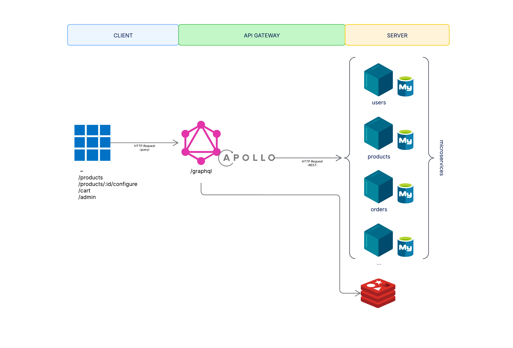
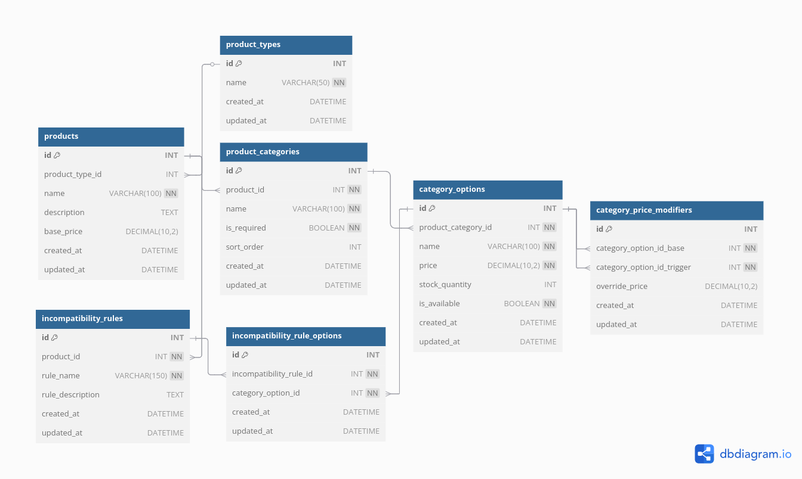
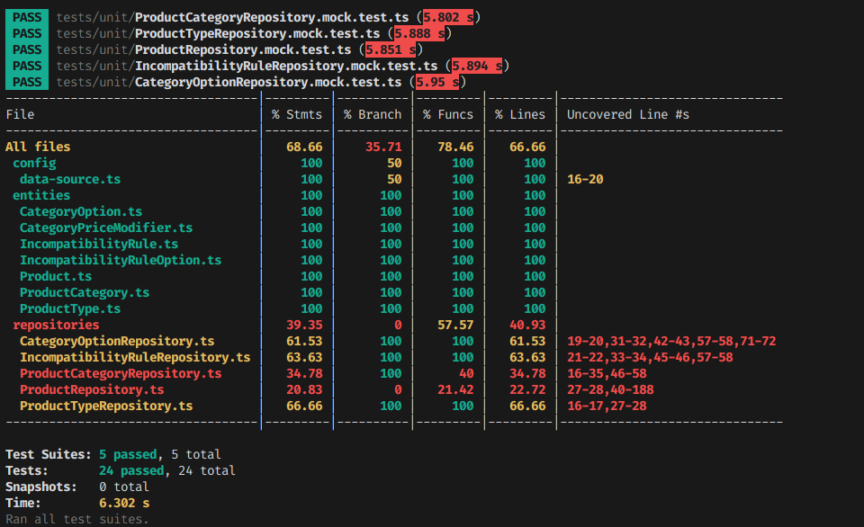
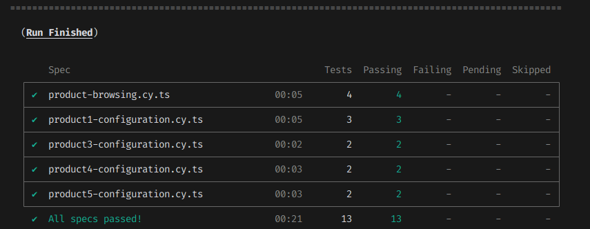

# Marcus Bikes

## Quick Summary
This repository showcase a frontend & backend split architecture for an e-commerce website focusing on customizable products. The goal is to demonstrate how customers can configure and buy products with dynamic pricing and restrictions between parts.


## Overview
- **Challenge**: Build a site for a bicycle shop owner (Marcus) who needs to sell customizable bicycles, and eventually other sports products, online
- **Scope**: Provide a structured data model for customizable products, reflect basic user actions: browsing, filtering, configuring & adding to cart
- **Key Points**:
  - Allow customers to fully customize products part by part
  - Enforce incompatibility rules between parts
  - Incorporate dynamic pricing that depends on chosen combinations

For a detailed explanation of the business logic, check out the [Notion page](https://spotty-breeze-612.notion.site/Marcus-s-online-bike-shop-1b76142fb46d80008a28eb5345735cef)

## Architecture & Tech Stack
Here is a brief overview of the main technologies used:

[](#)
[](#)
[](#)
[](#)
[](#)
[](#)
[](#)
[](#)
[](#)
[](#)
[](#)
[](#)
[](#)
[](#)
[](#)
[](#)
[](#)



1. The client sends GraphQL queries or mutations to the Apollo Server gateway
2. [WIP] The gateway checks Redis for cached data
3. If cache is stale or missing, it forwards requests via REST to Node.js microservices
4. Microservices interact with MySQL (*via TypeORM*) to fetch or modify data
5. Responses are returned to the gateway, optionally cached in Redis, and finally served to the client


## Data model


> See the [`/server/migrations` folder](./server/migrations) or [dbdiagram.io](https://dbdiagram.io/d/Marcuss-online-bike-shop-67d3ffe775d75cc84414c61b) for the complete DDL and details

## Installation & Usage

### Prerequisites

- [Node.js](https://nodejs.org/) (v18 or higher) & [npm](https://www.npmjs.com/) or [yarn](https://yarnpkg.com/) 
- [Docker](https://www.docker.com/get-started) and Docker Compose

### Environment setup

Before running the services, you need to set up the environment variables:

For the product microservice:
```bash
cd server/services/product-service
cp .env.example .env
```

For the API gateway:
```bash
cd server/gateway
cp .env.example .env
```

The `.env.example` files contain the default configuration that should work with the Docker database setup. The default database credentials are:

- Database name: `test`
- Username: `user`
- Password: `admin`

These values must match across the [docker-compose.yml](./server/docker-compose.yml) file and the environment files.

### Database setup

Navigate to the server directory and start the MySQL database using `docker-compose`:

```bash
cd server
docker-compose up -d
```

This will:
- Start a MySQL 8.0 container on port `3306`
- Create a database named `test`
- Automatically execute the initialization scripts:
  - [ddl.sql](./server/migrations/ddl.sql) - Creates all tables and relationships
  - [Inserts.sql](./server/migrations/inserts.sql) - Populates the database with sample data


### Backend services

#### 1. Start product microservice
```bash
cd server/services/product-service
npm install
npm run dev
```

> This will run on http://localhost:3001

#### 2. Start the API gateway

```bash
cd server/gateway
npm install
npm run dev
```

> This will run on http://localhost:4000

You can access also the GraphQL playground at http://localhost:4000/graphql to interact with the API directly.

### Frontend

```bash
cd client
npm install
npm start
```

> This will run on http://localhost:3000

### Running tests

#### Microservice tests

```bash
cd server/services/product-service
npm test
```



> There are several unit tests implemented, which while not particularly exhaustive, do cover 100% of the entities

#### Frontend tests

```bash
cd client
npm test         # Run all Cypress tests
npm run cypress:open  # Open Cypress test runner
```



> These e2e tests ensure coverage of certain use cases that users will encounter in the application


## Trade-Offs & Main Decisions

**Used a guided configurator instead of "pre-generated" variants**
- **Why**: Enhances user experience and "gamifies" shopping
- **Trade-off**: More complex frontend implementation vs. simpler product selection

**MySQL with TypeORM**
- **Why**: Strong relational integrity and familiar query language
- **Trade-off**: Less flexibility for varied product structures than NoSQL, but better data consistency

**Microservices over monolith**
- **Why**: Clear boundaries and independent scaling capabilities
- **Trade-off**: Added complexity but better separation of concerns

**GraphQL API through Apollo Gateway**
- **Why**: Flexible data fetching and reduced over-fetching
- **Trade-off**: Additional complexity layer but better control over response shape

**Redis caching layer**
- **Why**: Reduces database load for frequently accessed data in an application expected to receive high traffic
- **Trade-off**: Requires additional cache invalidation logic (possibly via RabbitMQ)

**Categories mapped to products, not product types**
- **Why**: Provides greater flexibility for different products
- **Trade-off**: Potential and almost inevitable data duplication

**Client-side filtering implementation**
- **Why**: Better UX with instant filtering feedback
- **Trade-off**: Impacts SEO

## WIP & TODO

- [ ] Implement persistent queries between client and API gateway via `Automatic Persisted Queries (APQ)`
- [ ] Set up Redis as a caching system for persistent query keys and product body responses
- [ ] Implement message queue system with `RabbitMQ` for cache invalidation
- [ ] Group incompatibility rules and price overrides into a single query for product details
- [ ] Implement a comprehensive logging and monitoring system
- [ ] Implement authentication system
- [ ] Develop product administration flows (client-side & server-side)
- [ ] Store cart information in database and implement mock checkout functionality
- [ ] Implement image slider and update data model accordingly
- [ ] Create 2D layered images in the product configurator
- [ ] Improve client-side filtering capabilities
- [ ] Enhance test coverage and implementation
- [ ] Set up `GitHub Actions` to run tests before pushing to main branch

...
